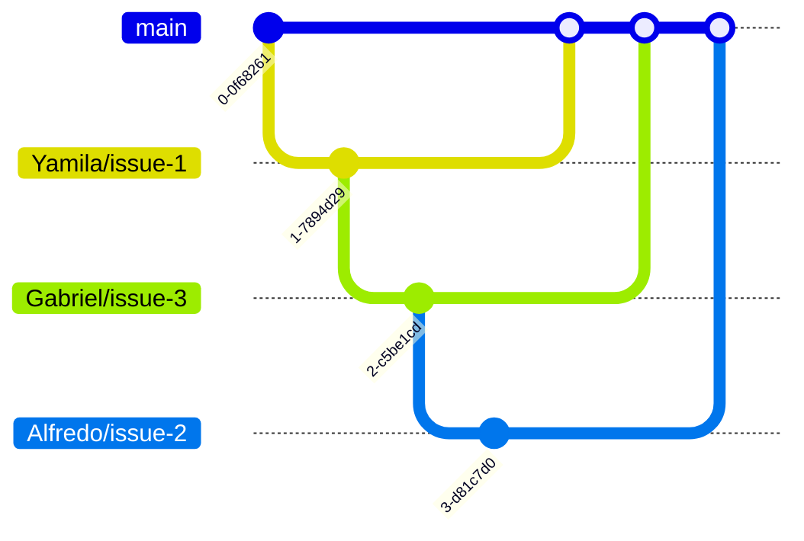
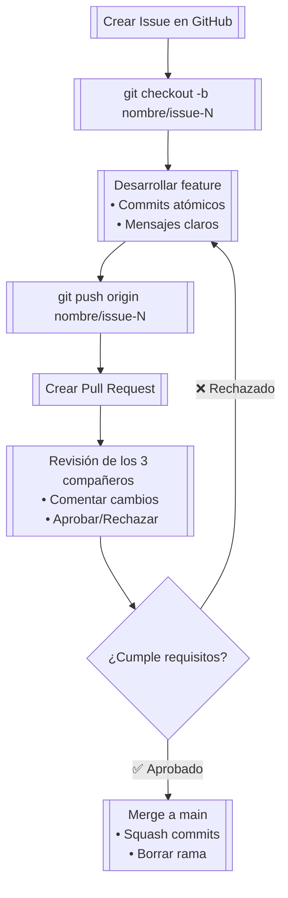

# Branch Policy (Política de Ramas)
## Dinamica
Todo trabajo debe estar realizado en un a rama y cada rama debe establecer una convención de nombre para poder ser identificable y fácilmente determinar su funcionalidad.
## Convención de Nombres para Ramas
Ejemplo: nombre/tarea (Alfredo/modificar_metodo).

| Componente       | Ejemplo       | Descripción                                  |
|------------------|---------------|----------------------------------------------|
| **Nombre**       | `Alfredo`     | Nombre del desarrollador responsable         |
| **Separador**    | `/`           | Diagonal para separar componentes            |
| **Referencia**   | `issue-2`     | Número del Issue asociado (sin #)            |

## Estructura de Ramas
La rama contara con el nombre del autor, una diagonal y con el numero de “Issue”, el merge (que fusiona la rama con la rama principal "main") será consensuado por el grupo.

## Flujo de trabajo para Ramas

## Restricciones del Equipo
- [x] Nunca commitear directamente en main.
- [x] Nombrar las ramas con la convension de nombres establecida.
- [x] Probar los cambios localmente antes de subirlos.
- [x] Cada PR debe ser revisado por los 3 compañeros.

> [!NOTE]
> Un PR (Pull Request) es una funcionalidad clave en Git/GitHub que permite proponer cambios en un repositorio y solicitar que se fusionen con la rama principal (como main). Es el mecanismo central para la colaboración en proyectos de desarrollo.

| El equipo | | |
|-------------|------|--------|
| Yamila Silva |  | [@yamila](https://github.com/YamilaAS) |
| Gabriel Villalobo |  | [@gabriel](https://github.com/kuhg) |
| Alfredo Galván |  | [@alfredo](https://github.com/AAGG22) |
